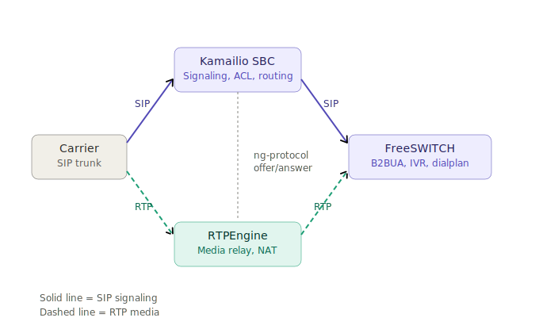
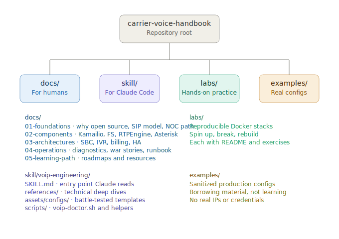
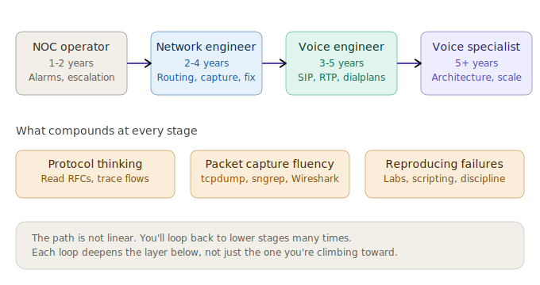
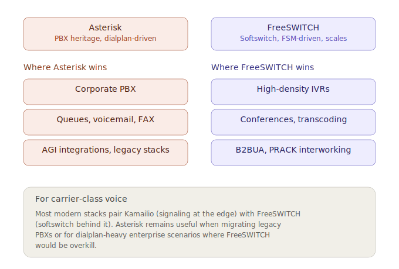
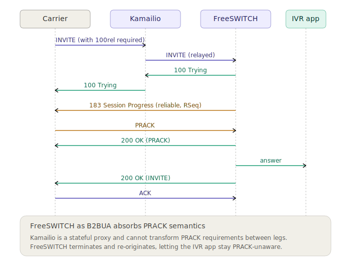

<div align="center">

# Carrier Voice Handbook

**Open-source carrier-grade voice infrastructure** — what 20 years in
telecom networks taught me, distilled into something you can read,
run, and learn from.

[](LICENSE)
[](skill/voip-engineering/)
[](#stack-covered)
[](#)
[](#)

</div>

---

## Why this exists

I started in a NOC, watching alarms and restarting cards on shifts that ended at 6 AM. Twenty years later I architect voice networks for a Tier-1 LATAM operator and run my own VoIP company. The path between those two points was paved with mistakes nobody had documented — every gotcha I publish here is one fewer 3 AM call for the engineer that comes after me.

This is not another Kamailio tutorial. The internet has those, and many are excellent. **This is the mental model, the decision framework, and the production scars I wish someone had handed me when I was looking up SIP RFCs at 2 AM with a P1 ticket open.**

It is also, deliberately, written from the LATAM trenches. The realities of Telcordia OAP billing, OSIPTEL portability, regional carriers that don't speak English, and air-gapped RHEL boxes in datacenters where the nearest senior engineer is six time zones away — these things rarely appear in upstream docs. They appear here.

---

## The stack at a glance

<div align="center">

</div>

The handbook focuses on the open-source carrier-class voice stack: **Kamailio** at the edge for signaling, **FreeSWITCH** behind it as softswitch and B2BUA, **RTPEngine** as the media relay. Everything else (Asterisk, CGRateS, dSIPRouter) is covered where it fits the picture.

---

## Who this is for

- **NOC engineers** moving from L2/L3 into voice and signaling.
- **Junior VoIP engineers** facing their first production SBC.
- **Senior engineers from proprietary stacks** (Cisco, Genband, Sonus, Ribbon) evaluating the open-source path.
- **Solution architects** weighing open-source vs. commercial Class 4/5 softswitches.
- **Anyone in LATAM** dealing with carrier interconnect, regulatory realities, and operators where the documentation is in a language the upstream community doesn't speak.

This is *not* for: SIP application developers building on top of Twilio, WebRTC frontend developers, or anyone looking for a how-to on building a home Asterisk PBX. There are better resources for those.

---

## What's inside

<div align="center">

</div>

### `docs/` — the handbook

A progressive learning path from foundations to operations. Each document is meant to be readable on its own, but they cross-link. Start wherever you like; the suggested entry point depends on where you are (see *How to use this* below).

### `skill/voip-engineering/` — the Claude Code skill

A production skill for [Claude Code](https://docs.claude.com/en/docs/claude-code/overview). Drop it into `~/.claude/skills/` and Claude becomes a copilot that knows the gotchas in this handbook. The skill includes reference docs, battle-tested config templates, and operational scripts (notably `voip-doctor.sh` — an end-to-end diagnostic with three modes: triage, capture with HTML+SVG flow diagram, and continuous monitor).

See [`skill/voip-engineering/SKILL.md`](skill/voip-engineering/SKILL.md) for full skill documentation.

### `labs/` — reproducible learning environments

Docker-compose stacks you can spin up on a laptop to practice without breaking production. Each lab has a `README.md` with objectives, expected behavior, and exercises.

### `examples/` — sanitized real-world configs

Production-derived configurations with credentials and internal hostnames redacted. Useful as starting points or as comparison material.

---

## A path, not a list of components

Most VoIP material treats the field as a flat catalog of tools. That's not how it works in practice. The path from a NOC chair to an architect who designs a Tier-1 voice core has shape — and skills that compound at every step.

<div align="center">

</div>

The roadmaps in [`docs/05-learning-path/`](docs/05-learning-path/) walk this in detail: what to study, what to build, and what to ignore at each stage.

---

## The first hard decision: Asterisk or FreeSWITCH?

If you're new to open-source voice, this is the question you'll hit within the first week. It's also the question with the most bad answers on the internet.

<div align="center">

</div>

The short version: for **carrier-class voice infrastructure**, the modern path is Kamailio + FreeSWITCH + RTPEngine. Asterisk remains the right tool for PBX-style deployments and legacy migrations. The deep dive in [`docs/02-components/asterisk-when-and-why.md`](docs/02-components/asterisk-when-and-why.md) covers this with concrete examples of each.

---

## A signaling flow worth seeing

Voice engineers spend more time staring at SIP ladder diagrams than at code. Here's a real one — a call to an IVR service where the carrier requires reliable provisional responses (`100rel` / PRACK) but the IVR application doesn't speak PRACK natively. FreeSWITCH as B2BUA absorbs the difference between the two legs.

<div align="center">

</div>

This is the kind of pattern documented throughout `docs/03-architectures/` and `docs/04-operations/common-failures.md`. Real flows from real carriers, with the false leads and root causes that the upstream docs never mention.

---

## How to use this

**If you're learning from scratch:**

1. Read `docs/01-foundations/` in order.
2. Run lab `01-hello-sip` and `02-kamailio-dispatcher`.
3. Read `docs/02-components/` for the deep dives.
4. Run the remaining labs.
5. Read `docs/04-operations/common-failures.md` — even before you have failures of your own. Pattern-recognition matters.

**If you already operate voice and want to learn the open-source side:**

1. Skim `docs/01-foundations/why-open-source-carrier.md` to align mental models.
2. Jump straight to `docs/02-components/` and `docs/03-architectures/`.
3. Install the skill into Claude Code so you have a copilot while you build your first stack.

**If you're operating already and have a problem right now:**

1. `docs/04-operations/diagnostics-playbook.md` is your starting point.
2. Run `skill/voip-engineering/scripts/voip-doctor.sh capture` to gather evidence before changing anything.
3. Search `docs/04-operations/common-failures.md` for symptoms matching yours.

---

## Installing the skill

There are three ways to install the `voip-engineering` skill, in order of recommendation:

### Option 1 — As a Claude Code plugin (recommended)

This is the cleanest path. From within Claude Code:

```
/plugin marketplace add apolo-next/carrier-voice-handbook
/plugin install voip-engineering@carrier-voice-handbook
```

Two commands. Done. Claude Code keeps the skill updated when you run `/plugin marketplace update`.

### Option 2 — Manual copy from the repo

If you prefer not to use the marketplace mechanism:

```bash
git clone https://github.com/apolo-next/carrier-voice-handbook.git
cp -r carrier-voice-handbook/skill/voip-engineering ~/.claude/skills/
```

Verify with:

```bash
claude
> /skills
# Should list voip-engineering
```

### Option 3 — Project-local installation

For team installation in a specific project, place it under `.claude/skills/` of your project repo and commit it. Anyone who clones the project gets the same Claude behavior when working on voice-related tasks.

```bash
mkdir -p .claude/skills/
cp -r path/to/voip-engineering .claude/skills/
git add .claude/skills/voip-engineering
git commit -m "Add voip-engineering skill"
```

<a id="stack-covered"></a>
## Stack covered

| Component | Role | Coverage |
|---|---|---|
| **[Kamailio](https://www.kamailio.org/)** | SIP proxy / SBC / registrar | Deep |
| **[FreeSWITCH](https://signalwire.com/freeswitch)** | Softswitch / B2BUA / IVR / media | Deep |
| **[RTPEngine](https://github.com/sipwise/rtpengine)** | RTP relay, NAT traversal | Deep |
| **[Asterisk](https://www.asterisk.org/)** | Legacy PBX, when migration is in scope | Moderate |
| **[CGRateS](https://cgrates.org/)** | Real-time billing engine | Moderate |
| **[dSIPRouter](https://dsiprouter.org/)** | Kamailio GUI/management | Light |

Things explicitly out of scope: Asterisk-only PBX deployments, proprietary SBCs (Oracle/Acme, Ribbon, Sonus), WebRTC gateways used purely for browser-to-browser, legacy SS7/TDM (briefly mentioned for context, not for implementation).

---

## On the shoulders of giants

This handbook would not exist without:

- The **Kamailio** team and the open mailing list, which has been the single best source of voice signaling knowledge on the internet for over a decade.
- The **FreeSWITCH / SignalWire** community, particularly the older ConfNumbers archive that taught a generation of engineers how a real softswitch behaves.
- The **OpenSIPS** community — even though this handbook focuses on Kamailio, OpenSIPS docs and forums saved me more than once.
- The **RTPEngine / Sipwise** team for building and open-sourcing one of the few production-grade RTP relays available outside vendor contracts.
- The colleagues, mentors, and shift partners across two decades of NOC rooms, core network teams, and engineering offices who taught me what the docs don't say. You know who you are.

If a chapter, a config, or a script in this repo saves you a midnight, the credit ultimately belongs to them.

---

## Contributing

Contributions are warmly welcome — see [`CONTRIBUTING.md`](CONTRIBUTING.md). Particularly welcome: war stories, regional context, lab improvements, and translations.

Code of conduct: be kind, be technical, share what you know.

---

## License

[Apache License 2.0](LICENSE) — use it, fork it, build with it, commercialize it, teach with it. If it saved you a midnight, that's payment enough.

---

<div align="center">

### A note on intent

I publish this in recognition of two decades in network engineering — from a NOC chair to architecting voice networks for a national operator — and as a way to leave the path easier than I found it.

The knowledge in here was gathered slowly, often painfully. Sharing it freely is the part of the work that gives the rest of it meaning.

If you build something good with this, that is enough.

**— Jesús Bazán**

*Maintained alongside [Apolo Next](https://github.com/apolo-next), where I build VoIP products for LATAM telcos.*

</div>
